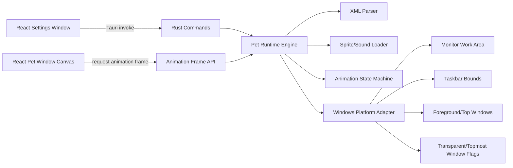

# Windows 11 Tauri React TypeScript Migration Implementation Plan

> **For Codex:** Execute this plan task-by-task. Keep changes small, verify each milestone, and avoid rewriting the old C# project until the new Tauri runtime proves the core pet behavior works.

**Goal:** Rebuild the existing DesktopPet/eSheep project as a Windows 11 desktop app using Tauri, React, and TypeScript while preserving compatibility with the existing pet XML format.

**Architecture:** Build a new Tauri app alongside the current C# project. Rust owns native desktop behavior, XML parsing, animation state, monitor/window/taskbar detection, file access, and app commands. React/TypeScript owns settings UI, debug UI, and canvas-based sprite rendering for transparent pet windows.

**Tech Stack:** Tauri v2, Rust, React, TypeScript, Vite, Canvas 2D, `quick-xml` or equivalent Rust XML parser, `windows` crate for Win32 integration.

---

## Operating Rules For Codex

- Work in small commits or clearly separated change sets.
- Do not delete the existing C# project during the migration.
- Put the new app under `tauri-app/` unless an existing Tauri project already exists.
- Reuse the current pet assets from `Pets/`, especially `Pets/esheep64/animations.xml`.
- Keep the first milestone narrow: one pet, one transparent window, walking/falling animation.
- Prefer compatibility with the existing `animations.xml` over inventing a new format.
- When implementation details are unclear, inspect the existing C# files first:
  - `src/dotNet/Program.cs`
  - `src/dotNet/FormPet.cs`
  - `src/dotNet/Animations.cs`
  - `src/dotNet/Xml.cs`
  - `src/Resources/animations.xsd`
  - `Pets/esheep64/animations.xml`

---

## Target Architecture



---

## Task 1: Repository Migration Assessment

**Files:**
- Read: `Readme.md`
- Read: `Download.md`
- Read: `src/dotNet/Program.cs`
- Read: `src/dotNet/FormPet.cs`
- Read: `src/dotNet/Animations.cs`
- Read: `src/dotNet/Xml.cs`
- Read: `src/Resources/animations.xsd`
- Read: `Pets/esheep64/animations.xml`
- Create: `docs/plans/tauri-migration-notes.md`

**Prompt For Codex:**

```text
分析当前 DesktopPet/eSheep 项目，为迁移到 Windows 11 + Tauri + React + TypeScript 做技术盘点。

请重点阅读：
- Readme.md
- Download.md
- src/dotNet/Program.cs
- src/dotNet/FormPet.cs
- src/dotNet/Animations.cs
- src/dotNet/Xml.cs
- src/Resources/animations.xsd
- Pets/esheep64/animations.xml

输出到 docs/plans/tauri-migration-notes.md，包含：
1. 当前 C# 项目的运行流程
2. animations.xml 的核心数据结构
3. FormPet 里依赖 WinForms/Win32 的能力清单
4. 可以直接复用的资产
5. 必须重写的模块
6. 第一版 MVP 的最小范围

不要修改源码，只新增分析文档。
```

**Verification:**

Run:

```powershell
Get-Content .\docs\plans\tauri-migration-notes.md -TotalCount 80
```

Expected: document exists and identifies C# runtime flow, XML model, reusable assets, and MVP scope.

**Commit Message:**

```text
docs: add Tauri migration assessment
```

---

## Task 2: Scaffold New Tauri App

**Files:**
- Create: `tauri-app/`
- Create: `tauri-app/package.json`
- Create: `tauri-app/src/`
- Create: `tauri-app/src-tauri/`

**Prompt For Codex:**

```text
在当前仓库中创建一个新的 Tauri v2 + React + TypeScript + Vite 应用，目录名为 tauri-app。

要求：
1. 不移动、不删除现有 C# 项目。
2. 使用 Tauri v2 推荐结构。
3. React 使用 TypeScript。
4. 添加基本 npm scripts：dev、build、tauri。
5. 初始化后不要实现业务功能，只确保空应用能启动。
6. 如果需要安装依赖，请先尝试使用现有环境；如果网络或权限失败，再说明需要授权。

完成后运行可用的检查命令，并告诉我本机启动命令。
```

**Verification:**

Run from `tauri-app/`:

```powershell
npm run build
```

Expected: React frontend builds successfully.

Then:

```powershell
npm run tauri dev
```

Expected: Tauri app opens a basic desktop window.

**Commit Message:**

```text
chore: scaffold Tauri React TypeScript app
```

---

## Task 3: Configure Multi-Window Shell

**Files:**
- Modify: `tauri-app/src-tauri/tauri.conf.json`
- Modify: `tauri-app/src-tauri/src/main.rs`
- Modify: `tauri-app/src/App.tsx`
- Create: `tauri-app/src/windows/SettingsWindow.tsx`
- Create: `tauri-app/src/windows/PetWindow.tsx`

**Prompt For Codex:**

```text
为 tauri-app 实现双窗口外壳：

1. settings 窗口：普通设置窗口，显示宠物列表占位、运行状态占位、调试按钮占位。
2. pet 窗口：透明、无边框、置顶、固定小尺寸，渲染一个 canvas，占位绘制简单矩形或测试图形。
3. Rust 侧提供命令 open_pet_window 和 close_pet_window。
4. React 设置页按钮可以打开/关闭 pet 窗口。
5. pet 窗口先不实现动画，只验证透明窗口、置顶和 canvas 绘制链路。

注意：目标平台是 Windows 11。实现时把窗口配置集中封装，后续方便加入点击穿透、Alt-Tab 隐藏和 DPI 处理。
```

**Verification:**

Run:

```powershell
npm run tauri dev
```

Expected:
- settings window opens.
- clicking the test control opens a transparent frameless pet window.
- pet window stays above normal windows.
- canvas is visible and nonblank.

**Commit Message:**

```text
feat: add settings and transparent pet windows
```

---

## Task 4: Add Pet XML Parser In Rust

**Files:**
- Create: `tauri-app/src-tauri/src/pet/mod.rs`
- Create: `tauri-app/src-tauri/src/pet/xml.rs`
- Create: `tauri-app/src-tauri/src/pet/model.rs`
- Create: `tauri-app/src-tauri/src/pet/tests.rs`
- Modify: `tauri-app/src-tauri/Cargo.toml`

**Prompt For Codex:**

```text
在 Rust 后端实现旧 animations.xml 的最小解析器。

读取参考：
- src/Resources/animations.xsd
- Pets/esheep64/animations.xml
- src/dotNet/Animations.cs
- src/dotNet/Xml.cs

第一版只需要解析：
1. header: author、title、petname、version、info、application、icon
2. image: tilesx、tilesy、png、transparency
3. spawns: spawn id、probability、x、y、next
4. animations: animation id、name、start、end、sequence frames、sequence next、border next、gravity next

要求：
- 使用 Rust 结构体表达解析结果。
- 添加单元测试，测试能解析 Pets/esheep64/animations.xml。
- 不需要立即解码图片。
- 保留表达式字符串，例如 screenW+10，不要在解析阶段求值。
```

**Verification:**

Run from `tauri-app/src-tauri/`:

```powershell
cargo test
```

Expected: parser tests pass and report that `esheep64` has header, image, spawns, and animations.

**Commit Message:**

```text
feat: parse legacy pet animation XML
```

---

## Task 5: Decode Sprite Sheet And Expose Pet Metadata

**Files:**
- Modify: `tauri-app/src-tauri/src/pet/model.rs`
- Modify: `tauri-app/src-tauri/src/pet/xml.rs`
- Create: `tauri-app/src-tauri/src/commands/pet.rs`
- Modify: `tauri-app/src-tauri/src/main.rs`
- Modify: `tauri-app/src/windows/SettingsWindow.tsx`
- Create: `tauri-app/src/types/pet.ts`

**Prompt For Codex:**

```text
实现从旧 animations.xml 加载宠物元信息和 sprite sheet 数据，并暴露给 React。

要求：
1. Rust 命令 load_pet_manifest 接收 XML 文件路径。
2. 返回 TypeScript 可消费的 JSON：
   - header 信息
   - tile 行列数
   - sprite sheet data URL 或前端可加载的临时资源引用
   - animation 数量
   - spawn 数量
3. React SettingsWindow 默认加载 ../Pets/esheep64/animations.xml，并展示 petname、title、version、tile 信息。
4. PetWindow 暂时只绘制 sprite sheet 的第 1 个 tile。
5. 添加错误处理：文件不存在、XML 解析失败、base64 图片失败。

优先让数据链路跑通，不要开始实现完整动画状态机。
```

**Verification:**

Run:

```powershell
npm run tauri dev
```

Expected:
- settings window displays eSheep metadata.
- pet window draws the first tile from the sprite sheet.
- invalid path shows a readable error.

**Commit Message:**

```text
feat: expose pet metadata and sprite sheet to UI
```

---

## Task 6: Implement Safe Expression Evaluator

**Files:**
- Create: `tauri-app/src-tauri/src/pet/expression.rs`
- Modify: `tauri-app/src-tauri/src/pet/mod.rs`
- Create: `tauri-app/src-tauri/src/pet/expression_tests.rs`

**Prompt For Codex:**

```text
实现 animations.xml 使用的安全表达式求值器。

参考 src/dotNet/Animations.cs 和 src/dotNet/Xml.cs 中对 TValue、ParseValue 的处理。

支持变量：
- screenW、screenH
- areaW、areaH
- imageW、imageH
- imageX、imageY
- parentX、parentY
- random
- randS

支持基础运算：
- + - * /
- 括号
- 整数和浮点数，最终输出整数

要求：
1. 禁止 eval 或执行任意代码。
2. 添加单元测试覆盖：
   - "screenW+10"
   - "areaH-imageH"
   - "random*(screenW-imageW-50)/100+25"
   - 常量 "200"
3. random 每次可变化，randS 在同一次 spawn context 中保持稳定。
```

**Verification:**

Run:

```powershell
cargo test
```

Expected: expression tests pass.

**Commit Message:**

```text
feat: add safe animation expression evaluator
```

---

## Task 7: Implement Animation Runtime MVP

**Files:**
- Create: `tauri-app/src-tauri/src/pet/runtime.rs`
- Modify: `tauri-app/src-tauri/src/pet/model.rs`
- Modify: `tauri-app/src-tauri/src/commands/pet.rs`
- Modify: `tauri-app/src/windows/PetWindow.tsx`
- Modify: `tauri-app/src/types/pet.ts`

**Prompt For Codex:**

```text
实现第一版宠物动画运行时 MVP。

目标：
1. 加载 Pets/esheep64/animations.xml。
2. 根据 spawns 选择初始位置和初始 animation。
3. 按 sequence frames 输出当前 tile index。
4. 按 start/end 的 x、y、interval、offsety、opacity 移动。
5. sequence 播完后按 next probability 选择下一 animation。
6. 暂不做窗口碰撞，先把 area 底部当作地面。

Rust 后端维护 runtime state，并提供 next_pet_frame 命令。
React PetWindow 用 requestAnimationFrame 或 setTimeout 请求下一帧并绘制 canvas。

验收重点是：eSheep 能在透明窗口里按 XML 帧序列移动，而不是静态显示。
```

**Verification:**

Run:

```powershell
npm run tauri dev
```

Expected:
- pet window shows animated eSheep.
- frame sequence changes over time.
- pet position changes according to XML.
- no visible white background around the pet.

**Commit Message:**

```text
feat: run legacy XML animation loop
```

---

## Task 8: Add Windows 11 Platform Adapter

**Files:**
- Create: `tauri-app/src-tauri/src/platform/mod.rs`
- Create: `tauri-app/src-tauri/src/platform/windows.rs`
- Modify: `tauri-app/src-tauri/Cargo.toml`
- Modify: `tauri-app/src-tauri/src/pet/runtime.rs`

**Prompt For Codex:**

```text
为 Windows 11 添加 platform adapter，封装桌面环境能力。

需要实现：
1. 获取所有显示器的 bounds 和 work area。
2. 获取主显示器 work area。
3. 检测任务栏边界或至少使用 work area 底部作为任务栏碰撞线。
4. 为 pet window 设置透明、置顶、无边框所需配置。
5. 预留 API：is_fullscreen_window_active、find_window_under_pet、set_click_through。

要求：
- 用 Rust 模块隔离 Windows 专有代码。
- 非 Windows 编译时提供 stub 或明确错误。
- 不要把 Win32 细节散落在业务 runtime 里。
- 添加 debug 命令 dump_platform_info，SettingsWindow 可以显示 monitor/work area 信息。
```

**Verification:**

Run:

```powershell
npm run tauri dev
```

Expected:
- settings window can show monitor/work area info.
- pet uses work area bottom as floor.
- app still builds on Windows 11.

**Commit Message:**

```text
feat: add Windows platform adapter
```

---

## Task 9: Implement Gravity And Border Behavior

**Files:**
- Modify: `tauri-app/src-tauri/src/pet/runtime.rs`
- Modify: `tauri-app/src-tauri/src/pet/model.rs`
- Add tests: `tauri-app/src-tauri/src/pet/runtime_tests.rs`

**Prompt For Codex:**

```text
在动画 runtime 中实现 XML 的 gravity 和 border next 逻辑。

参考：
- src/dotNet/FormPet.cs
- src/dotNet/Animations.cs
- Pets/esheep64/animations.xml

要求：
1. 当宠物离开 work area floor 时，使用 gravity next 选择下一个动画。
2. 当宠物碰到左右边界或上下边界时，使用 border next 选择下一个动画。
3. 支持 next only 条件：
   - none
   - taskbar
   - window 先保留但可不触发
   - horizontal
   - horizontal+
   - vertical
4. 支持 action flip，能改变绘制方向和 x movement。
5. 添加 runtime 单元测试覆盖 next 选择和边界触发。

第一版不需要真实窗口碰撞，只要屏幕/工作区/任务栏边界行为正确。
```

**Verification:**

Run:

```powershell
cargo test
npm run tauri dev
```

Expected:
- pet hits boundary then turns or changes animation.
- pet falls until floor and resumes floor animation.
- tests pass.

**Commit Message:**

```text
feat: support gravity and border animation transitions
```

---

## Task 10: Add Settings UI For Pet Selection And Runtime Controls

**Files:**
- Modify: `tauri-app/src/windows/SettingsWindow.tsx`
- Create: `tauri-app/src/components/PetSelector.tsx`
- Create: `tauri-app/src/components/RuntimeControls.tsx`
- Modify: `tauri-app/src-tauri/src/commands/pet.rs`

**Prompt For Codex:**

```text
实现 Windows 11 桌面宠物设置界面。

要求：
1. 扫描仓库 Pets/ 目录，列出包含 animations.xml 的宠物。
2. 设置页可以选择宠物并打开 pet window。
3. 支持运行控制：
   - start
   - pause
   - resume
   - close
   - spawn another pet
4. 显示当前宠物元信息：petname、title、author、version。
5. 显示基础 debug 信息：当前 animation id/name、frame index、position。
6. UI 使用 React + TypeScript，保持功能型界面，不做营销页面。

不要引入复杂状态管理，除非当前代码已经需要。
```

**Verification:**

Run:

```powershell
npm run tauri dev
```

Expected:
- settings window lists pets from `Pets/`.
- selecting `esheep64` starts that pet.
- pause/resume/close controls work.

**Commit Message:**

```text
feat: add pet selector and runtime controls
```

---

## Task 11: Add Sound Playback Support

**Files:**
- Modify: `tauri-app/src-tauri/src/pet/model.rs`
- Modify: `tauri-app/src-tauri/src/pet/xml.rs`
- Create: `tauri-app/src-tauri/src/audio.rs`
- Modify: `tauri-app/src-tauri/src/pet/runtime.rs`

**Prompt For Codex:**

```text
迁移 animations.xml 的 sounds 支持。

要求：
1. 解析 sounds/sound，包含 animationid、probability、loop、base64。
2. 当进入或播放对应 animation 时，根据 probability 播放声音。
3. Rust 后端负责音频播放，避免 React 直接处理 base64 音频。
4. 添加设置项：mute/unmute。
5. 播放失败不能导致宠物 runtime 崩溃，只记录 debug error。

如果当前依赖选择不明确，比较 rodio、cpal 或 Tauri 可用音频方案，选择最小可行方案并记录理由。
```

**Verification:**

Run:

```powershell
cargo test
npm run tauri dev
```

Expected:
- XML sound data parses.
- mute/unmute works.
- sound failure is reported but does not crash app.

**Commit Message:**

```text
feat: add pet sound playback
```

---

## Task 12: Add Multi-Pet Support

**Files:**
- Modify: `tauri-app/src-tauri/src/pet/runtime.rs`
- Modify: `tauri-app/src-tauri/src/commands/pet.rs`
- Modify: `tauri-app/src/windows/SettingsWindow.tsx`
- Modify: `tauri-app/src/windows/PetWindow.tsx`

**Prompt For Codex:**

```text
实现多个宠物实例。

要求：
1. 每个宠物实例有唯一 petInstanceId。
2. 每个实例可以对应一个独立 transparent pet window。
3. SettingsWindow 显示当前运行实例列表。
4. 支持关闭单个实例和关闭全部实例。
5. runtime state 不要使用单例，只能通过 petInstanceId 访问。
6. 保留最多实例数限制配置，默认 2 或 4，避免失控。

注意不要破坏单宠物 MVP 行为。
```

**Verification:**

Run:

```powershell
npm run tauri dev
```

Expected:
- can spawn two pet windows.
- each pet animates independently.
- closing one does not close the other.

**Commit Message:**

```text
feat: support multiple pet instances
```

---

## Task 13: Add Window Collision Detection

**Files:**
- Modify: `tauri-app/src-tauri/src/platform/windows.rs`
- Modify: `tauri-app/src-tauri/src/pet/runtime.rs`
- Add tests where practical: `tauri-app/src-tauri/src/pet/runtime_tests.rs`

**Prompt For Codex:**

```text
实现 Windows 11 下的窗口碰撞检测，使宠物可以在普通窗口顶部行走。

参考旧实现：
- src/dotNet/FormPet.cs 中 FallDetect、CheckTopWindow、CheckFullScreen 相关逻辑

要求：
1. Rust platform adapter 枚举或查询 pet 当前位置下方的可见窗口。
2. 忽略 pet 自己的窗口。
3. 忽略不可见、最小化、透明或系统特殊窗口。
4. runtime 将检测结果映射为 next only="window" 条件。
5. 如果检测失败，回退到 work area floor，不能崩溃。
6. 设置页增加开关：enable window collision。

先做可靠性优先，不追求完全复刻所有旧行为。
```

**Verification:**

Run:

```powershell
npm run tauri dev
```

Expected:
- moving a normal app window under pet changes its floor/collision behavior.
- disabling window collision returns to taskbar/work-area-only behavior.

**Commit Message:**

```text
feat: detect desktop window collisions
```

---

## Task 14: Add Click Behavior And Context Menu

**Files:**
- Modify: `tauri-app/src/windows/PetWindow.tsx`
- Modify: `tauri-app/src-tauri/src/platform/windows.rs`
- Modify: `tauri-app/src-tauri/src/commands/pet.rs`

**Prompt For Codex:**

```text
实现宠物交互行为。

要求：
1. 右键 pet window 打开上下文菜单：
   - Open Settings
   - Add Pet
   - Pause/Resume
   - Close This Pet
   - Exit
2. 支持拖拽宠物，拖拽时切换到 XML 中 name=drag 的动画，如果存在。
3. 支持双击关闭或触发 kill 动画，取决于旧 XML 是否有对应动画。
4. 评估 click-through：默认关闭，提供设置开关。
5. click-through 仅影响 pet window，不影响 settings window。
```

**Verification:**

Run:

```powershell
npm run tauri dev
```

Expected:
- right-click menu works.
- pet can be dragged.
- settings window can still be opened.
- click-through toggle behaves predictably.

**Commit Message:**

```text
feat: add pet interactions and context menu
```

---

## Task 15: Package For Windows 11

**Files:**
- Modify: `tauri-app/src-tauri/tauri.conf.json`
- Modify: `tauri-app/package.json`
- Create: `tauri-app/README.md`
- Create: `docs/plans/windows11-release-checklist.md`

**Prompt For Codex:**

```text
配置 Windows 11 发布打包。

要求：
1. 配置 Tauri app metadata：name、identifier、version、icons。
2. 生成 Windows installer 或 portable bundle，按 Tauri v2 推荐方式。
3. 写 tauri-app/README.md，说明开发、构建、运行、打包命令。
4. 写 docs/plans/windows11-release-checklist.md，包含：
   - Windows 11 测试项
   - 多显示器测试项
   - DPI 缩放测试项
   - 透明窗口测试项
   - 杀软/签名风险
   - 已知限制
5. 不要承诺已签名，除非实际配置了证书。
```

**Verification:**

Run:

```powershell
npm run tauri build
```

Expected:
- Windows bundle is produced.
- README documents exact commands and output location.

**Commit Message:**

```text
chore: configure Windows 11 packaging
```

---

## Suggested Codex Session Strategy

Use separate Codex sessions for groups of tasks:

1. **Session A: Discovery and scaffold**
   - Task 1
   - Task 2
   - Task 3

2. **Session B: XML and sprite compatibility**
   - Task 4
   - Task 5
   - Task 6

3. **Session C: Runtime MVP**
   - Task 7
   - Task 8
   - Task 9

4. **Session D: Product controls**
   - Task 10
   - Task 11
   - Task 12

5. **Session E: Windows polish and release**
   - Task 13
   - Task 14
   - Task 15

---

## First Codex Prompt To Start With

```text
我正在把当前 DesktopPet/eSheep C# 项目迁移为 Windows 11 + Tauri + React + TypeScript。

请先执行 docs/plans/2026-05-15-tauri-react-typescript-windows11-migration.md 中的 Task 1。

要求：
1. 只做技术盘点，不修改源码。
2. 阅读任务中列出的 C#、XML、XSD 和 README 文件。
3. 新增 docs/plans/tauri-migration-notes.md。
4. 输出当前 C# 项目运行流程、XML 数据模型、WinForms/Win32 依赖点、可复用资产、必须重写模块、MVP 范围。
5. 完成后运行 Get-Content 验证文档存在，并总结下一步。
```

---

## MVP Definition

The migration MVP is complete when:

- A Tauri app starts on Windows 11.
- A settings window can open a transparent pet window.
- `Pets/esheep64/animations.xml` loads without manual conversion.
- The eSheep sprite sheet is decoded and rendered.
- The pet animates using XML frame sequences.
- The pet can spawn, walk, fall, and respond to screen/work-area borders.
- The app can be packaged for Windows 11.

Features intentionally after MVP:

- Full offline pet editor migration.
- Online pet download system.
- Perfect parity with all old WinForms window detection behavior.
- Microsoft Store packaging.
- Code signing.

